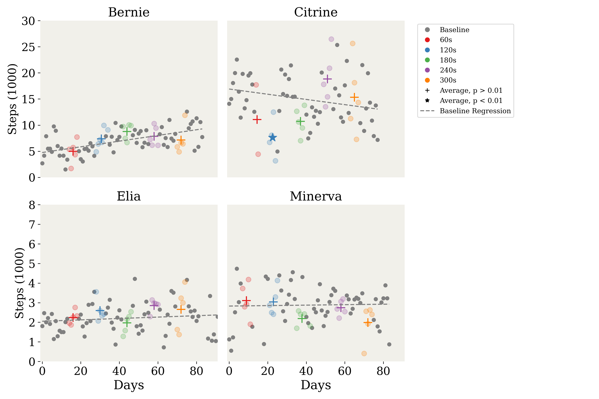
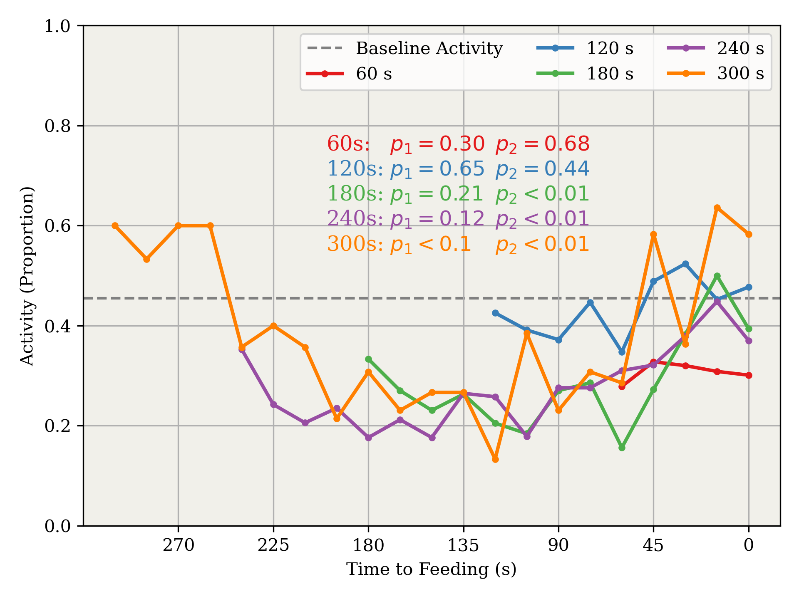
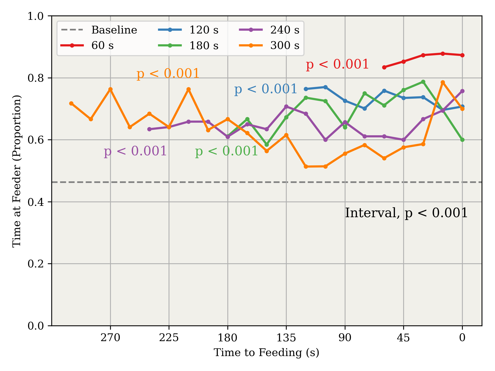
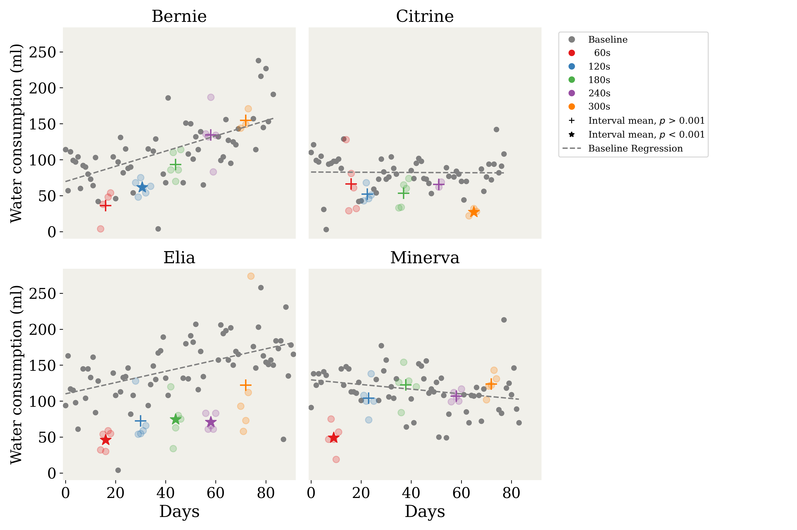

# Supplementary Materials

This document accompanies the manuscript *"Effects of a fixed-time food delivery on the behavior of domestic cats (Felis catus)"*. It contains the full statistical output for the analyses summarised in the Results section of the paper.

The supplement is organised in the same order as the paper:

1. Step counts
2. Activity patterns across the food-to-food interval
3. Space allocation (time near the feeder)
4. Water consumption

All tables in this supplement are regenerated from the raw data (`data/`) by running `SCRIPT_compile_stat_results.py`. The figures reproduced here are the same figures that appear in the main text.


# Step Counts

Daily step counts were recorded throughout the study using a Fitbit Zip on each cat's collar. To test whether FT food delivery altered step counts beyond intrinsic baseline variation, we fit a per-cat OLS regression of daily step count on day using baseline observations only, then compared the distribution of residuals from that fit against the residuals obtained by applying the same model to the FT-interval days. A Kolmogorov–Smirnov two-sample test was used to test whether the two distributions could be drawn from the same underlying distribution. Figure 2 (reproduced below) shows the raw daily step counts and the fitted baseline trend for each cat.



## Baseline regression models

The tables below give the per-cat baseline OLS regressions of daily step count (in thousands) on day number, fit on baseline observations only. For each cat, the model is:

```
Steps ~ Days
```

The `Days` coefficient captures the intrinsic linear trend across the study period; the residuals from these fits are used in the Kolmogorov–Smirnov tests reported in the next subsection.

### Bernie

```
                            OLS Regression Results                            
==============================================================================
Dep. Variable:                  steps   R-squared:                       0.352
Model:                            OLS   Adj. R-squared:                  0.340
Method:                 Least Squares   F-statistic:                     30.41
Date:                Sat, 16 May 2026   Prob (F-statistic):           9.23e-07
Time:                        18:28:22   Log-Likelihood:                -120.19
No. Observations:                  58   AIC:                             244.4
Df Residuals:                      56   BIC:                             248.5
Df Model:                           1                                         
Covariance Type:            nonrobust                                         
==============================================================================
                 coef    std err          t      P>|t|      [0.025      0.975]
------------------------------------------------------------------------------
Intercept      4.7564      0.476     10.001      0.000       3.804       5.709
Days           0.0544      0.010      5.515      0.000       0.035       0.074
==============================================================================
Omnibus:                        0.593   Durbin-Watson:                   1.952
Prob(Omnibus):                  0.743   Jarque-Bera (JB):                0.664
Skew:                           0.223   Prob(JB):                        0.717
Kurtosis:                       2.724   Cond. No.                         89.2
==============================================================================

Notes:
[1] Standard Errors assume correct specification of covariance matrix.
```

### Citrine

```
                            OLS Regression Results                            
==============================================================================
Dep. Variable:                  steps   R-squared:                       0.072
Model:                            OLS   Adj. R-squared:                  0.054
Method:                 Least Squares   F-statistic:                     3.895
Date:                Sat, 16 May 2026   Prob (F-statistic):             0.0540
Time:                        18:28:22   Log-Likelihood:                -150.25
No. Observations:                  52   AIC:                             304.5
Df Residuals:                      50   BIC:                             308.4
Df Model:                           1                                         
Covariance Type:            nonrobust                                         
==============================================================================
                 coef    std err          t      P>|t|      [0.025      0.975]
------------------------------------------------------------------------------
Intercept     16.9085      1.161     14.557      0.000      14.576      19.241
Days          -0.0498      0.025     -1.973      0.054      -0.101       0.001
==============================================================================
Omnibus:                        0.695   Durbin-Watson:                   1.574
Prob(Omnibus):                  0.706   Jarque-Bera (JB):                0.522
Skew:                           0.242   Prob(JB):                        0.770
Kurtosis:                       2.922   Cond. No.                         86.9
==============================================================================

Notes:
[1] Standard Errors assume correct specification of covariance matrix.
```

### Elia

```
                            OLS Regression Results                            
==============================================================================
Dep. Variable:                  steps   R-squared:                       0.017
Model:                            OLS   Adj. R-squared:                  0.001
Method:                 Least Squares   F-statistic:                     1.054
Date:                Sat, 16 May 2026   Prob (F-statistic):              0.309
Time:                        18:28:22   Log-Likelihood:                -70.141
No. Observations:                  62   AIC:                             144.3
Df Residuals:                      60   BIC:                             148.5
Df Model:                           1                                         
Covariance Type:            nonrobust                                         
==============================================================================
                 coef    std err          t      P>|t|      [0.025      0.975]
------------------------------------------------------------------------------
Intercept      2.0513      0.179     11.491      0.000       1.694       2.408
Days           0.0035      0.003      1.027      0.309      -0.003       0.010
==============================================================================
Omnibus:                        1.439   Durbin-Watson:                   1.441
Prob(Omnibus):                  0.487   Jarque-Bera (JB):                0.955
Skew:                           0.297   Prob(JB):                        0.620
Kurtosis:                       3.133   Cond. No.                         95.2
==============================================================================

Notes:
[1] Standard Errors assume correct specification of covariance matrix.
```

### Minerva

```
                            OLS Regression Results                            
==============================================================================
Dep. Variable:                  steps   R-squared:                       0.001
Model:                            OLS   Adj. R-squared:                 -0.018
Method:                 Least Squares   F-statistic:                   0.04356
Date:                Sat, 16 May 2026   Prob (F-statistic):              0.835
Time:                        18:28:22   Log-Likelihood:                -76.059
No. Observations:                  54   AIC:                             156.1
Df Residuals:                      52   BIC:                             160.1
Df Model:                           1                                         
Covariance Type:            nonrobust                                         
==============================================================================
                 coef    std err          t      P>|t|      [0.025      0.975]
------------------------------------------------------------------------------
Intercept      2.8276      0.286      9.881      0.000       2.253       3.402
Days           0.0012      0.006      0.209      0.835      -0.010       0.012
==============================================================================
Omnibus:                        1.117   Durbin-Watson:                   1.136
Prob(Omnibus):                  0.572   Jarque-Bera (JB):                1.170
Skew:                          -0.292   Prob(JB):                        0.557
Kurtosis:                       2.578   Cond. No.                         106.
==============================================================================

Notes:
[1] Standard Errors assume correct specification of covariance matrix.
```

## Kolmogorov–Smirnov tests of FT vs. baseline residual distributions

Each row compares the distribution of residuals from the corresponding cat's baseline regression against the distribution of residuals obtained by applying that same baseline model to the FT interval named in the comparison column. A *p*-value below 0.001 indicates that the FT-interval residuals differ significantly from baseline residuals — i.e., that the intervention altered step counts beyond what would be expected from intrinsic baseline variation.

| Subject   | Comparison                | KS statistic   | p-value   |
|:----------|:--------------------------|:---------------|:----------|
| Bernie    | interval 60s vs Baseline  | ks = 0.283     | p = 0.763 |
| Bernie    | interval 120s vs Baseline | ks = 0.351     | p = 0.415 |
| Bernie    | interval 180s vs Baseline | ks = 0.497     | p = 0.147 |
| Bernie    | interval 240s vs Baseline | ks = 0.210     | p = 0.955 |
| Bernie    | interval 300s vs Baseline | ks = 0.645     | p = 0.023 |
| Citrine   | interval 60s vs Baseline  | ks = 0.500     | p = 0.563 |
| Citrine   | interval 120s vs Baseline | ks = 0.808     | p = 0.005 |
| Citrine   | interval 180s vs Baseline | ks = 0.519     | p = 0.119 |
| Citrine   | interval 240s vs Baseline | ks = 0.481     | p = 0.178 |
| Citrine   | interval 300s vs Baseline | ks = 0.246     | p = 0.884 |
| Elia      | interval 60s vs Baseline  | ks = 0.355     | p = 0.499 |
| Elia      | interval 120s vs Baseline | ks = 0.452     | p = 0.228 |
| Elia      | interval 180s vs Baseline | ks = 0.290     | p = 0.739 |
| Elia      | interval 240s vs Baseline | ks = 0.639     | p = 0.025 |
| Elia      | interval 300s vs Baseline | ks = 0.439     | p = 0.250 |
| Minerva   | interval 60s vs Baseline  | ks = 0.226     | p = 0.929 |
| Minerva   | interval 120s vs Baseline | ks = 0.296     | p = 0.728 |
| Minerva   | interval 180s vs Baseline | ks = 0.630     | p = 0.031 |
| Minerva   | interval 240s vs Baseline | ks = 0.389     | p = 0.396 |
| Minerva   | interval 300s vs Baseline | ks = 0.630     | p = 0.031 |


# Activity Patterns Across the Food-to-Food Interval

Activity was scored from video using a 15-second instantaneous time-sampling method; at each sample point the cat was classified as active (any movement or interaction) or inactive (resting or pausing). To assess how activity was allocated across each food-to-food interval, we fit two logistic regressions (`smf.logit`) per FT interval, pooling data across cats: one for the first two-thirds of the interval and one for the final third. Each model used `TimeSinceFeeding` and `C(Subject)` as predictors, and we tested whether the slope on `TimeSinceFeeding` differed significantly from zero. For the 60s interval, which contains only four sample points, the two-thirds split falls between the second and third points, so the two segments are effectively halves rather than thirds. Figure 3 (reproduced below) shows the average proportion of intervals marked as active across the food-to-food interval. Open circles mark data points in the first two-thirds of each interval, and filled circles mark those in the final one-third, corresponding to the two segments fit by the piecewise models below.



## Logistic models per FT interval (first 2/3 and final 1/3)

For each FT interval below, the first table gives the logit fit for the first segment and the second table for the final segment. A positive slope on `TimeSinceFeeding` indicates that the probability of being active rises across the segment; a negative slope indicates it falls. The `p`-value on the `TimeSinceFeeding` row tests whether the slope differs significantly from zero.

### 60s interval

**First segment (first 2/3 of interval):**

```
                           Logit Regression Results                           
==============================================================================
Dep. Variable:                 Active   No. Observations:                  488
Model:                          Logit   Df Residuals:                      484
Method:                           MLE   Df Model:                            3
Date:                Sat, 16 May 2026   Pseudo R-squ.:                 0.04769
Time:                        18:28:22   Log-Likelihood:                -288.26
converged:                       True   LL-Null:                       -302.69
Covariance Type:            nonrobust   LLR p-value:                 2.387e-06
=====================================================================================
                        coef    std err          z      P>|z|      [0.025      0.975]
-------------------------------------------------------------------------------------
Intercept             0.4877      0.351      1.390      0.164      -0.200       1.175
Subject = Elia       -1.1217      0.247     -4.533      0.000      -1.607      -0.637
Subject = Minerva    -1.0771      0.248     -4.341      0.000      -1.563      -0.591
TimeSinceFeeding     -0.0231      0.013     -1.708      0.088      -0.050       0.003
=====================================================================================
```

**Second segment (final 1/3 of interval):**

```
                           Logit Regression Results                           
==============================================================================
Dep. Variable:                 Active   No. Observations:                  487
Model:                          Logit   Df Residuals:                      483
Method:                           MLE   Df Model:                            3
Date:                Sat, 16 May 2026   Pseudo R-squ.:                 0.03339
Time:                        18:28:22   Log-Likelihood:                -303.90
converged:                       True   LL-Null:                       -314.40
Covariance Type:            nonrobust   LLR p-value:                 0.0001056
=====================================================================================
                        coef    std err          z      P>|z|      [0.025      0.975]
-------------------------------------------------------------------------------------
Intercept            -2.6132      0.714     -3.660      0.000      -4.012      -1.214
Subject = Elia       -0.5354      0.241     -2.219      0.026      -1.008      -0.063
Subject = Minerva    -0.7026      0.245     -2.864      0.004      -1.183      -0.222
TimeSinceFeeding      0.0458      0.013      3.498      0.000       0.020       0.071
=====================================================================================
```

### 120s interval

**First segment (first 2/3 of interval):**

```
                           Logit Regression Results                           
==============================================================================
Dep. Variable:                 Active   No. Observations:                  551
Model:                          Logit   Df Residuals:                      546
Method:                           MLE   Df Model:                            4
Date:                Sat, 16 May 2026   Pseudo R-squ.:                  0.1328
Time:                        18:28:22   Log-Likelihood:                -312.03
converged:                       True   LL-Null:                       -359.83
Covariance Type:            nonrobust   LLR p-value:                 8.516e-20
=====================================================================================
                        coef    std err          z      P>|z|      [0.025      0.975]
-------------------------------------------------------------------------------------
Intercept             0.6358      0.275      2.313      0.021       0.097       1.175
Subject = Citrine    -1.3530      0.268     -5.052      0.000      -1.878      -0.828
Subject = Elia       -2.0174      0.252     -8.020      0.000      -2.510      -1.524
Subject = Minerva    -2.2682      0.305     -7.438      0.000      -2.866      -1.670
TimeSinceFeeding      0.0027      0.005      0.575      0.566      -0.006       0.012
=====================================================================================
```

**Second segment (final 1/3 of interval):**

```
                           Logit Regression Results                           
==============================================================================
Dep. Variable:                 Active   No. Observations:                  324
Model:                          Logit   Df Residuals:                      319
Method:                           MLE   Df Model:                            4
Date:                Sat, 16 May 2026   Pseudo R-squ.:                  0.1456
Time:                        18:28:22   Log-Likelihood:                -187.73
converged:                       True   LL-Null:                       -219.72
Covariance Type:            nonrobust   LLR p-value:                 4.252e-13
=====================================================================================
                        coef    std err          z      P>|z|      [0.025      0.975]
-------------------------------------------------------------------------------------
Intercept            -6.8073      1.153     -5.904      0.000      -9.067      -4.547
Subject = Citrine    -1.2505      0.379     -3.303      0.001      -1.993      -0.508
Subject = Elia       -1.3703      0.333     -4.118      0.000      -2.022      -0.718
Subject = Minerva    -0.5576      0.362     -1.540      0.124      -1.267       0.152
TimeSinceFeeding      0.0683      0.011      6.298      0.000       0.047       0.090
=====================================================================================
```

### 180s interval

**First segment (first 2/3 of interval):**

```
                           Logit Regression Results                           
==============================================================================
Dep. Variable:                 Active   No. Observations:                  471
Model:                          Logit   Df Residuals:                      466
Method:                           MLE   Df Model:                            4
Date:                Sat, 16 May 2026   Pseudo R-squ.:                  0.1733
Time:                        18:28:22   Log-Likelihood:                -239.05
converged:                       True   LL-Null:                       -289.14
Covariance Type:            nonrobust   LLR p-value:                 8.938e-21
=====================================================================================
                        coef    std err          z      P>|z|      [0.025      0.975]
-------------------------------------------------------------------------------------
Intercept             1.3888      0.304      4.575      0.000       0.794       1.984
Subject = Citrine    -1.1504      0.304     -3.781      0.000      -1.747      -0.554
Subject = Elia       -2.1627      0.317     -6.814      0.000      -2.785      -1.541
Subject = Minerva    -2.2866      0.328     -6.972      0.000      -2.929      -1.644
TimeSinceFeeding     -0.0160      0.003     -4.637      0.000      -0.023      -0.009
=====================================================================================
```

**Second segment (final 1/3 of interval):**

```
                           Logit Regression Results                           
==============================================================================
Dep. Variable:                 Active   No. Observations:                  229
Model:                          Logit   Df Residuals:                      224
Method:                           MLE   Df Model:                            4
Date:                Sat, 16 May 2026   Pseudo R-squ.:                  0.1054
Time:                        18:28:22   Log-Likelihood:                -136.87
converged:                       True   LL-Null:                       -153.00
Covariance Type:            nonrobust   LLR p-value:                 1.691e-06
=====================================================================================
                        coef    std err          z      P>|z|      [0.025      0.975]
-------------------------------------------------------------------------------------
Intercept            -6.4208      1.431     -4.488      0.000      -9.225      -3.617
Subject = Citrine    -1.0766      0.442     -2.433      0.015      -1.944      -0.209
Subject = Elia       -0.9195      0.384     -2.392      0.017      -1.673      -0.166
Subject = Minerva    -0.8926      0.390     -2.290      0.022      -1.656      -0.129
TimeSinceFeeding      0.0416      0.009      4.627      0.000       0.024       0.059
=====================================================================================
```

### 240s interval

**First segment (first 2/3 of interval):**

```
                           Logit Regression Results                           
==============================================================================
Dep. Variable:                 Active   No. Observations:                  531
Model:                          Logit   Df Residuals:                      526
Method:                           MLE   Df Model:                            4
Date:                Sat, 16 May 2026   Pseudo R-squ.:                  0.1936
Time:                        18:28:22   Log-Likelihood:                -225.81
converged:                       True   LL-Null:                       -280.02
Covariance Type:            nonrobust   LLR p-value:                 1.589e-22
=====================================================================================
                        coef    std err          z      P>|z|      [0.025      0.975]
-------------------------------------------------------------------------------------
Intercept             0.6110      0.278      2.199      0.028       0.066       1.156
Subject = Citrine    -2.4003      0.373     -6.436      0.000      -3.131      -1.669
Subject = Elia       -1.4499      0.268     -5.404      0.000      -1.976      -0.924
Subject = Minerva    -3.1442      0.488     -6.437      0.000      -4.102      -2.187
TimeSinceFeeding     -0.0076      0.003     -2.756      0.006      -0.013      -0.002
=====================================================================================
```

**Second segment (final 1/3 of interval):**

```
                           Logit Regression Results                           
==============================================================================
Dep. Variable:                 Active   No. Observations:                  280
Model:                          Logit   Df Residuals:                      275
Method:                           MLE   Df Model:                            4
Date:                Sat, 16 May 2026   Pseudo R-squ.:                  0.1746
Time:                        18:28:22   Log-Likelihood:                -150.62
converged:                       True   LL-Null:                       -182.49
Covariance Type:            nonrobust   LLR p-value:                 4.746e-13
=====================================================================================
                        coef    std err          z      P>|z|      [0.025      0.975]
-------------------------------------------------------------------------------------
Intercept            -4.8439      1.168     -4.148      0.000      -7.133      -2.555
Subject = Citrine    -1.0072      0.363     -2.776      0.006      -1.718      -0.296
Subject = Elia       -2.2305      0.402     -5.548      0.000      -3.019      -1.443
Subject = Minerva    -1.9570      0.419     -4.675      0.000      -2.777      -1.137
TimeSinceFeeding      0.0261      0.006      4.576      0.000       0.015       0.037
=====================================================================================
```

### 300s interval

**First segment (first 2/3 of interval):**

```
                           Logit Regression Results                           
==============================================================================
Dep. Variable:                 Active   No. Observations:                  536
Model:                          Logit   Df Residuals:                      531
Method:                           MLE   Df Model:                            4
Date:                Sat, 16 May 2026   Pseudo R-squ.:                 0.09096
Time:                        18:28:22   Log-Likelihood:                -315.13
converged:                       True   LL-Null:                       -346.66
Covariance Type:            nonrobust   LLR p-value:                 6.586e-13
=====================================================================================
                        coef    std err          z      P>|z|      [0.025      0.975]
-------------------------------------------------------------------------------------
Intercept             0.8772      0.248      3.533      0.000       0.391       1.364
Subject = Citrine    -0.4818      0.263     -1.831      0.067      -0.998       0.034
Subject = Elia       -0.5221      0.242     -2.161      0.031      -0.996      -0.048
Subject = Minerva    -1.6867      0.312     -5.398      0.000      -2.299      -1.074
TimeSinceFeeding     -0.0094      0.002     -5.316      0.000      -0.013      -0.006
=====================================================================================
```

**Second segment (final 1/3 of interval):**

```
                           Logit Regression Results                           
==============================================================================
Dep. Variable:                 Active   No. Observations:                  283
Model:                          Logit   Df Residuals:                      278
Method:                           MLE   Df Model:                            4
Date:                Sat, 16 May 2026   Pseudo R-squ.:                  0.1142
Time:                        18:28:22   Log-Likelihood:                -162.82
converged:                       True   LL-Null:                       -183.81
Covariance Type:            nonrobust   LLR p-value:                 1.690e-08
=====================================================================================
                        coef    std err          z      P>|z|      [0.025      0.975]
-------------------------------------------------------------------------------------
Intercept            -5.2401      1.198     -4.375      0.000      -7.588      -2.892
Subject = Citrine    -0.9090      0.372     -2.442      0.015      -1.638      -0.179
Subject = Elia       -0.7684      0.342     -2.249      0.025      -1.438      -0.099
Subject = Minerva    -1.8594      0.435     -4.279      0.000      -2.711      -1.008
TimeSinceFeeding      0.0210      0.005      4.524      0.000       0.012       0.030
=====================================================================================
```


# Location (Time in Feeder Area)

At each 15-second sample point the cat's location was scored using a six-zone system covering the run, plus several non-zone categories (Shelf, Fence, Litter Box, Out of View; see `Library/AnalysisBehavior.read_data` for the full mapping). For analysis the location was collapsed into a binary `AtFeeder` outcome — Feeder Area vs. Non-Feeder; the exact zone-to-category mapping is in the `loc_cat` lambda of `read_data`. Three logistic models were fit on this outcome to characterise how proximity to the feeder varied across baseline and the FT conditions.

Figure 4 (reproduced below) shows the average proportion of intervals spent in the feeder area across the food-to-food interval. Open circles mark data points in the first two-thirds of each interval, and filled circles mark those in the final one-third, corresponding to the two segments fit by the piecewise models below.



## Effect of FT interval (categorical, baseline as reference)

A logistic regression was fit on all observations (baseline plus all five FT intervals), pooling data across cats. FT interval was encoded as a categorical predictor with baseline as the reference level; subject was included as a fixed effect. The model is:

```
AtFeeder ~ C(Subject) + C(Feeder_Interval) + TimeSinceFeeding
```

Each `Feeder_Interval = N` coefficient tests whether time in the feeder area during that interval differs significantly from baseline.

```
                           Logit Regression Results                           
==============================================================================
Dep. Variable:               AtFeeder   No. Observations:                 6479
Model:                          Logit   Df Residuals:                     6469
Method:                           MLE   Df Model:                            9
Date:                Sat, 16 May 2026   Pseudo R-squ.:                  0.1329
Time:                        18:28:23   Log-Likelihood:                -3679.8
converged:                       True   LL-Null:                       -4244.1
Covariance Type:            nonrobust   LLR p-value:                3.310e-237
=========================================================================================
                            coef    std err          z      P>|z|      [0.025      0.975]
-----------------------------------------------------------------------------------------
Intercept                -0.5430      0.056     -9.626      0.000      -0.654      -0.432
Subject = Citrine        -0.2339      0.076     -3.089      0.002      -0.382      -0.085
Subject = Elia            1.0726      0.079     13.653      0.000       0.919       1.227
Subject = Minerva         1.2707      0.083     15.334      0.000       1.108       1.433
Feeder_Interval = 60      1.8377      0.114     16.121      0.000       1.614       2.061
Feeder_Interval = 120     0.9389      0.098      9.541      0.000       0.746       1.132
Feeder_Interval = 180     1.0078      0.115      8.796      0.000       0.783       1.232
Feeder_Interval = 240     0.9202      0.119      7.747      0.000       0.687       1.153
Feeder_Interval = 300     0.7657      0.131      5.838      0.000       0.509       1.023
TimeSinceFeeding         -0.0003      0.001     -0.463      0.644      -0.001       0.001
=========================================================================================
```

## Effect of interval length on time at feeder (continuous, intervention only)

A second logistic regression was fit on the intervention observations only (baseline excluded), treating FT interval length as a continuous predictor. This tests whether longer FT intervals are associated with systematically more or less time in the feeder area. The model is:

```
AtFeeder ~ C(Subject) + Feeder_Interval + TimeSinceFeeding
```

A significant negative slope on `Feeder_Interval` indicates that as interval length increases, cats spend less time near the feeder.

```
                           Logit Regression Results                           
==============================================================================
Dep. Variable:               AtFeeder   No. Observations:                 4180
Model:                          Logit   Df Residuals:                     4174
Method:                           MLE   Df Model:                            5
Date:                Sat, 16 May 2026   Pseudo R-squ.:                  0.1881
Time:                        18:28:23   Log-Likelihood:                -1970.0
converged:                       True   LL-Null:                       -2426.4
Covariance Type:            nonrobust   LLR p-value:                4.694e-195
=====================================================================================
                        coef    std err          z      P>|z|      [0.025      0.975]
-------------------------------------------------------------------------------------
Intercept             0.4190      0.120      3.490      0.000       0.184       0.654
Subject = Citrine     0.2379      0.097      2.463      0.014       0.049       0.427
Subject = Elia        2.2132      0.114     19.440      0.000       1.990       2.436
Subject = Minerva     2.4406      0.131     18.631      0.000       2.184       2.697
Feeder_Interval      -0.0025      0.001     -4.391      0.000      -0.004      -0.001
TimeSinceFeeding     -0.0003      0.001     -0.478      0.633      -0.002       0.001
=====================================================================================
```

## Logistic models per FT interval (first 2/3 and final 1/3)

For each FT interval the data was split into the first two-thirds of the food-to-food interval and the final third, and a logistic regression was fit separately to each segment, using `TimeSinceFeeding` and `C(Subject)` as predictors. For the 60s interval, which contains only four sample points, the two-thirds split falls between the second and third points so the two segments are effectively halves. For the 240s final-third model, Minerva was excluded because she was at the feeder in all 57 of her observations in that segment, which caused the logit fit to diverge; her exclusion did not change the `TimeSinceFeeding` slope or *p*-value to four decimal places.

For each interval below, the first table gives the logit fit for the first segment and the second table for the final segment. A positive slope on `TimeSinceFeeding` indicates that the probability of being in the feeder area rises across the segment; a negative slope indicates it falls.

### 60s interval

**First segment (first 2/3 of interval):**

```
                           Logit Regression Results                           
==============================================================================
Dep. Variable:               AtFeeder   No. Observations:                  488
Model:                          Logit   Df Residuals:                      484
Method:                           MLE   Df Model:                            3
Date:                Sat, 16 May 2026   Pseudo R-squ.:                 0.04302
Time:                        18:28:23   Log-Likelihood:                -177.81
converged:                       True   LL-Null:                       -185.80
Covariance Type:            nonrobust   LLR p-value:                  0.001141
=====================================================================================
                        coef    std err          z      P>|z|      [0.025      0.975]
-------------------------------------------------------------------------------------
Intercept             1.4565      0.471      3.094      0.002       0.534       2.379
Subject = Elia        1.0688      0.329      3.248      0.001       0.424       1.714
Subject = Minerva     1.1694      0.341      3.429      0.001       0.501       1.838
TimeSinceFeeding     -0.0111      0.018     -0.603      0.547      -0.047       0.025
=====================================================================================
```

**Second segment (final 1/3 of interval):**

```
                           Logit Regression Results                           
==============================================================================
Dep. Variable:               AtFeeder   No. Observations:                  487
Model:                          Logit   Df Residuals:                      483
Method:                           MLE   Df Model:                            3
Date:                Sat, 16 May 2026   Pseudo R-squ.:                  0.1249
Time:                        18:28:23   Log-Likelihood:                -162.47
converged:                       True   LL-Null:                       -185.66
Covariance Type:            nonrobust   LLR p-value:                 4.669e-10
=====================================================================================
                        coef    std err          z      P>|z|      [0.025      0.975]
-------------------------------------------------------------------------------------
Intercept            -0.4107      1.021     -0.402      0.688      -2.412       1.591
Subject = Elia        2.2374      0.410      5.457      0.000       1.434       3.041
Subject = Minerva     1.5558      0.332      4.689      0.000       0.905       2.206
TimeSinceFeeding      0.0238      0.019      1.237      0.216      -0.014       0.062
=====================================================================================
```

### 120s interval

**First segment (first 2/3 of interval):**

```
                           Logit Regression Results                           
==============================================================================
Dep. Variable:               AtFeeder   No. Observations:                  551
Model:                          Logit   Df Residuals:                      546
Method:                           MLE   Df Model:                            4
Date:                Sat, 16 May 2026   Pseudo R-squ.:                  0.1108
Time:                        18:28:23   Log-Likelihood:                -291.13
converged:                       True   LL-Null:                       -327.39
Covariance Type:            nonrobust   LLR p-value:                 6.637e-15
=====================================================================================
                        coef    std err          z      P>|z|      [0.025      0.975]
-------------------------------------------------------------------------------------
Intercept             0.5298      0.277      1.915      0.055      -0.012       1.072
Subject = Citrine     0.0713      0.257      0.278      0.781      -0.432       0.574
Subject = Elia        1.0073      0.244      4.122      0.000       0.528       1.486
Subject = Minerva     2.7981      0.488      5.737      0.000       1.842       3.754
TimeSinceFeeding     -0.0061      0.005     -1.273      0.203      -0.015       0.003
=====================================================================================
```

**Second segment (final 1/3 of interval):**

```
                           Logit Regression Results                           
==============================================================================
Dep. Variable:               AtFeeder   No. Observations:                  324
Model:                          Logit   Df Residuals:                      319
Method:                           MLE   Df Model:                            4
Date:                Sat, 16 May 2026   Pseudo R-squ.:                  0.1681
Time:                        18:28:23   Log-Likelihood:                -168.54
converged:                       True   LL-Null:                       -202.59
Covariance Type:            nonrobust   LLR p-value:                 5.718e-14
=====================================================================================
                        coef    std err          z      P>|z|      [0.025      0.975]
-------------------------------------------------------------------------------------
Intercept            -2.7080      1.177     -2.301      0.021      -5.015      -0.402
Subject = Citrine     0.4246      0.339      1.253      0.210      -0.240       1.089
Subject = Elia        1.7337      0.330      5.254      0.000       1.087       2.380
Subject = Minerva     3.0733      0.565      5.437      0.000       1.965       4.181
TimeSinceFeeding      0.0228      0.011      2.095      0.036       0.001       0.044
=====================================================================================
```

### 180s interval

**First segment (first 2/3 of interval):**

```
                           Logit Regression Results                           
==============================================================================
Dep. Variable:               AtFeeder   No. Observations:                  471
Model:                          Logit   Df Residuals:                      466
Method:                           MLE   Df Model:                            4
Date:                Sat, 16 May 2026   Pseudo R-squ.:                  0.3545
Time:                        18:28:23   Log-Likelihood:                -186.10
converged:                       True   LL-Null:                       -288.31
Covariance Type:            nonrobust   LLR p-value:                 4.206e-43
=====================================================================================
                        coef    std err          z      P>|z|      [0.025      0.975]
-------------------------------------------------------------------------------------
Intercept            -0.3559      0.314     -1.132      0.258      -0.972       0.260
Subject = Citrine    -1.1455      0.307     -3.734      0.000      -1.747      -0.544
Subject = Elia        3.1282      0.487      6.423      0.000       2.174       4.083
Subject = Minerva     3.3490      0.536      6.250      0.000       2.299       4.399
TimeSinceFeeding      0.0058      0.004      1.525      0.127      -0.002       0.013
=====================================================================================
```

**Second segment (final 1/3 of interval):**

```
                           Logit Regression Results                           
==============================================================================
Dep. Variable:               AtFeeder   No. Observations:                  229
Model:                          Logit   Df Residuals:                      224
Method:                           MLE   Df Model:                            4
Date:                Sat, 16 May 2026   Pseudo R-squ.:                  0.2429
Time:                        18:28:23   Log-Likelihood:                -98.925
converged:                       True   LL-Null:                       -130.66
Covariance Type:            nonrobust   LLR p-value:                 5.395e-13
=====================================================================================
                        coef    std err          z      P>|z|      [0.025      0.975]
-------------------------------------------------------------------------------------
Intercept            -1.4151      1.653     -0.856      0.392      -4.654       1.824
Subject = Citrine     0.7878      0.408      1.930      0.054      -0.012       1.588
Subject = Elia        3.1168      0.639      4.881      0.000       1.865       4.368
Subject = Minerva     3.0679      0.640      4.797      0.000       1.814       4.321
TimeSinceFeeding      0.0079      0.010      0.764      0.445      -0.012       0.028
=====================================================================================
```

### 240s interval

**First segment (first 2/3 of interval):**

```
                           Logit Regression Results                           
==============================================================================
Dep. Variable:               AtFeeder   No. Observations:                  531
Model:                          Logit   Df Residuals:                      526
Method:                           MLE   Df Model:                            4
Date:                Sat, 16 May 2026   Pseudo R-squ.:                  0.2789
Time:                        18:28:23   Log-Likelihood:                -244.24
converged:                       True   LL-Null:                       -338.68
Covariance Type:            nonrobust   LLR p-value:                 9.200e-40
=====================================================================================
                        coef    std err          z      P>|z|      [0.025      0.975]
-------------------------------------------------------------------------------------
Intercept            -0.6434      0.269     -2.391      0.017      -1.171      -0.116
Subject = Citrine     0.7352      0.255      2.884      0.004       0.236       1.235
Subject = Elia        2.3926      0.287      8.349      0.000       1.831       2.954
Subject = Minerva     5.4468      1.020      5.343      0.000       3.449       7.445
TimeSinceFeeding     -0.0005      0.003     -0.193      0.847      -0.005       0.005
=====================================================================================
```

**Second segment (final 1/3 of interval):**

```
                           Logit Regression Results                           
==============================================================================
Dep. Variable:               AtFeeder   No. Observations:                  223
Model:                          Logit   Df Residuals:                      219
Method:                           MLE   Df Model:                            3
Date:                Sat, 16 May 2026   Pseudo R-squ.:                  0.1579
Time:                        18:28:23   Log-Likelihood:                -120.48
converged:                       True   LL-Null:                       -143.07
Covariance Type:            nonrobust   LLR p-value:                 8.488e-10
=====================================================================================
                        coef    std err          z      P>|z|      [0.025      0.975]
-------------------------------------------------------------------------------------
Intercept            -1.7117      1.239     -1.381      0.167      -4.141       0.717
Subject = Citrine     0.5725      0.340      1.685      0.092      -0.093       1.239
Subject = Elia        2.6130      0.480      5.443      0.000       1.672       3.554
TimeSinceFeeding      0.0077      0.006      1.287      0.198      -0.004       0.019
=====================================================================================
```

### 300s interval

**First segment (first 2/3 of interval):**

```
                           Logit Regression Results                           
==============================================================================
Dep. Variable:               AtFeeder   No. Observations:                  536
Model:                          Logit   Df Residuals:                      531
Method:                           MLE   Df Model:                            4
Date:                Sat, 16 May 2026   Pseudo R-squ.:                  0.1970
Time:                        18:28:23   Log-Likelihood:                -266.37
converged:                       True   LL-Null:                       -331.71
Covariance Type:            nonrobust   LLR p-value:                 2.773e-27
=====================================================================================
                        coef    std err          z      P>|z|      [0.025      0.975]
-------------------------------------------------------------------------------------
Intercept             0.2237      0.255      0.876      0.381      -0.277       0.724
Subject = Citrine     0.0965      0.251      0.385      0.700      -0.395       0.588
Subject = Elia        3.2052      0.421      7.611      0.000       2.380       4.031
Subject = Minerva     1.5448      0.286      5.400      0.000       0.984       2.105
TimeSinceFeeding     -0.0033      0.002     -1.762      0.078      -0.007       0.000
=====================================================================================
```

**Second segment (final 1/3 of interval):**

```
                           Logit Regression Results                           
==============================================================================
Dep. Variable:               AtFeeder   No. Observations:                  283
Model:                          Logit   Df Residuals:                      278
Method:                           MLE   Df Model:                            4
Date:                Sat, 16 May 2026   Pseudo R-squ.:                  0.3280
Time:                        18:28:23   Log-Likelihood:                -128.20
converged:                       True   LL-Null:                       -190.78
Covariance Type:            nonrobust   LLR p-value:                 4.194e-26
=====================================================================================
                        coef    std err          z      P>|z|      [0.025      0.975]
-------------------------------------------------------------------------------------
Intercept            -3.1388      1.340     -2.342      0.019      -5.765      -0.512
Subject = Citrine    -1.4327      0.412     -3.480      0.001      -2.240      -0.626
Subject = Elia        3.5266      0.636      5.543      0.000       2.280       4.773
Subject = Minerva     1.0834      0.370      2.929      0.003       0.358       1.808
TimeSinceFeeding      0.0116      0.005      2.241      0.025       0.001       0.022
=====================================================================================
```


# Water Consumption

<!-- TODO: 2–3 sentence intro: same residual-comparison approach as for step counts; baseline OLS regression of in-session water consumption (ml) on day, fitted per cat; per-interval residuals compared against baseline residuals via KS test; alpha level 0.001; note phase-1 dependent variable = "session" (in-session consumption); see AnalysisDrink for phase definitions and Citrine/Elia date cutoffs -->



## Baseline regression models (phase 1, in-session consumption)

<!-- INSERT: drinking_regressions -->

## Kolmogorov–Smirnov tests of FT vs. baseline residual distributions

<!-- INSERT: drinking_ks_table -->
